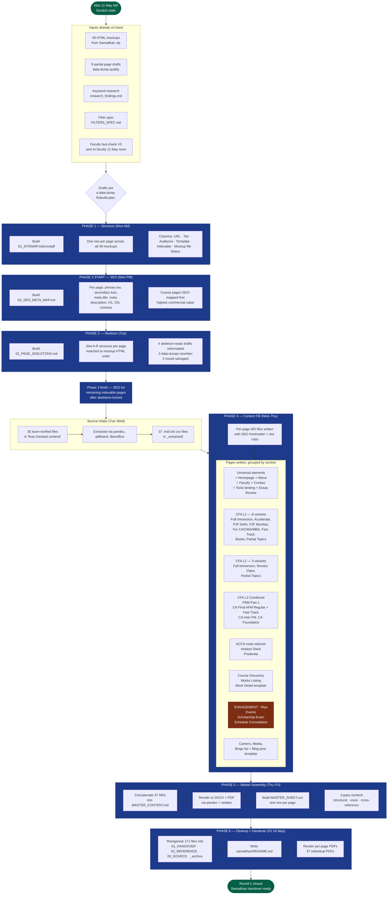

# SSEI Website Rebuild — Content Workstream

**Owner.** Kavya Bahety (Head of Growth and Operations)
**Contributor.** Riya (engagement pages: Events, Scholarship Exam, Schedule Consultation)
**Vendor.** Samadhan
**Period.** 11 May 2026 → 15 May 2026 (5 working days, first round closed)
**KRA.** KRA4 — Growth Initiatives, New Projects and Distribution
**Tagged KPIs.** k_4_1 (Kavya, Innovation Velocity) · r_4_1 (Riya, New Project Execution Support)

---

## Outcome (what got delivered)

| Deliverable | Count | Format |
|---|---|---|
| Page master files (one per page, SEO-optimised, slot-by-slot copy) | **37** | Markdown |
| Consolidated master document | **1** | MD + DOCX + PDF (5,910 lines, 45,611 words) |
| Master sheet (one row per page) | **1** | CSV (36 page rows) |
| Annotated HTML wireframes | **4** | HTML |
| Reference documents (sitemap, SEO map, skeletons, faculty fact-check, filter spec, research) | **6 sets** | MD + PDF |
| Source files extracted and structured | **35 verified + 37 converted** | DOCX/PDF/XLSX → MD/TXT/CSV |

**Hard BLOCKERS surfaced.** 4 (CFA L3 pricing, Prudentia pricing, CFA L2 Corporate Issuers anchor, CFA L2/FRM/CA Final mock pricing).
**Open flags raised for Sales/Ops.** 35 across the 36 pages.

---

## The flow (scratch → handover)



> Riya's contribution highlighted in orange (Engagement: Events, Scholarship Exam, Schedule Consultation).

---

## What got built, where it lives

Final folder structure inside `working/samadhan/`:

```
01_HANDOVER/        ← What Samadhan receives. 45 files, 1.5M.
  ├── MASTER_CONTENT.md / .docx / .pdf
  ├── MASTER_SHEET.csv
  ├── per_page/      (37 individual MDs + 37 individual PDFs)
  └── annotated_mockups/ (4 HTML wireframes)

02_REFERENCE/       ← Supporting docs. 12 files, 8.5M.
  ├── 01_SITEMAP.md / .csv / .pdf
  ├── 02_PAGE_SKELETONS.md / .pdf
  ├── 03_SEO_META_MAP.md / .pdf
  ├── FACULTY_FACTCHECK_DOC.md / .pdf
  ├── FILTERS_SPEC.md / .pdf
  └── research_findings.md

03_SOURCE/          ← Inputs, read-only. 72 files, 19M.
  ├── team_verified/  (35 original DOCX/PDF/XLSX)
  └── extracted/      (37 converted .md/.txt/.csv)

_archive/           ← Paper trail. 42 files.
  ├── old_page_drafts/         (10 rejected draft files)
  ├── old_04_PAGES_singles/    (superseded standalone pages)
  ├── rejected_data_dumps/     (4 early data-dump outputs)
  ├── early_phase_trackers/    (6 trackers + emails)
  └── gsheet_push_scripts/     (4 Python scripts no longer needed)

README.md           ← Entry point explaining the structure.
```

---

## Tagged actions in the tracker

### Kavya (KPI k_4_1 — Innovation Velocity, 13% weight)
| Action ID | Title | Status | Notes |
|---|---|---|---|
| a_4_07 | Website rebuild — Phase 1: Sitemap + structure | completed | 49 mockups → SITEMAP.md/csv/pdf |
| a_4_08 | Website rebuild — Phase 2 + 3: SEO + Skeletons | completed | 02_PAGE_SKELETONS, 03_SEO_META_MAP |
| a_4_09 | Website rebuild — Phase 4: 30 page MDs (Kavya scope) | completed | All non-engagement pages |
| a_4_10 | Website rebuild — Phase 5: Master assembly + 3-pass recheck | completed | MASTER_CONTENT MD/DOCX/PDF, MASTER_SHEET.csv |
| a_4_11 | Website rebuild — Phase 6: Cleanup + Samadhan handover | completed | 171 files reorganised, README written |

### Riya (KPI r_4_1 — New Project Execution Support, 10% weight)
| Action ID | Title | Status | Notes |
|---|---|---|---|
| a_4_12 | Website rebuild — Engagement pages: Events (P30) | completed | Full filter spec, calendar layout, tabs |
| a_4_13 | Website rebuild — Engagement pages: Scholarship Exam (P31) | completed | Live cohort spec, tiers, eligibility |
| a_4_14 | Website rebuild — Engagement pages: Schedule Consultation (P32) | completed | Form fields, advisor routing, post-submit flow |

---

## Decision log (for context, not for tracking)

| Date | Decision | Why |
|---|---|---|
| 11 May | Phase 1 (Sitemap) before Phase 2 (Skeleton) | Page list locks first. Skeleton order can shift later without invalidating SEO map. |
| 12 May | FRM Part 2 stripped from combos | Not currently offered, per Kavya's directive. |
| 13 May | Karan Aggarwal Sir stripped from all faculty references | Confirmed no longer SSEI faculty. |
| 13 May | Homepage subhead — use team-verified verbatim copy | 8 iterations rejected before reverting to team-supplied text. Voice rules locked. |
| 14 May | Pricing page replaced by Tools page | Per board doc decision. /pricing route deprecated. |
| 14 May | All combo cards link to /courses?type=combo filter, no standalone combo landing | Cleaner taxonomy, fewer dead pages. |
| 15 May | Workspace cleanup: archive not delete | Preserves paper trail for Vidyut review and any rollback. |

---

## What this work demonstrates (for KRA scoring)

- **Innovation Velocity (k_4_1).** Shipped a 36-page, 45,611-word, SEO-optimised content brief in 5 working days from a "data dump" starting point. New-project delivery on a real deadline.
- **Delegation (k_5_2).** Engagement-page workstream owned end-to-end by Riya, not by Kavya. Three pages, full SEO frontmatter, filter spec, form spec.
- **Stakeholder & Vendor mgmt (k_5_1).** Samadhan handover packaged with README, structured folders, source provenance, and an open-flags log per page so the vendor doesn't need a kickoff call to start work.
