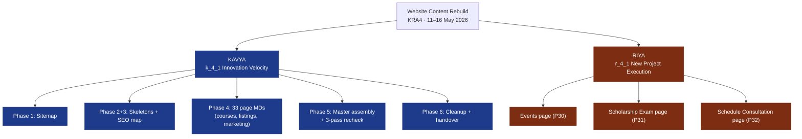

# Website Content Rebuild

**From scratch to vendor-ready handover in 5 working days.**

| | |
|---|---|
| **Vertical** | Growth & Ops |
| **KRA / KPI** | KRA4 (Growth Initiatives) → k_4_1 Innovation Velocity (Kavya), r_4_1 New Project Execution Support (Riya) |
| **Period** | 11 May 2026 — 16 May 2026 |
| **Lead** | Kavya |
| **Contributor** | Riya (3 engagement pages: Events, Scholarship Exam, Schedule Consultation) |
| **Vendor** | Samadhan (will build the live website from this content) |

---

## 1. Why this matters

SSEI signed Samadhan to rebuild the website. Samadhan are builders, not writers. Before they can ship a single page, they need a finished page-by-page content brief: what the page says, in what order, with what SEO targets, linking where. That brief didn't exist on Monday morning.

The choice was either (a) Samadhan writes guesswork content because no one gave them a brief, and SSEI catches errors in QA at the end, costing 4-6 weeks of rework, or (b) Growth & Ops gives them a complete, source-verified, SEO-optimised brief upfront so they build it right the first time.

This work is option (b). It is the spine the new website is being built on.

---

## 2. Before vs after

```mermaid
flowchart LR
    subgraph Before["MONDAY 11 MAY — Starting state"]
        direction TB
        B1["49 vendor mockups<br/>(HTML files, no content)"]
        B2["9 partial drafts<br/>(rejected as data-dump)"]
        B3["35 verified team source files<br/>(unstructured pile)"]
        B4["Faculty fact-check<br/>sent that morning"]
        B5["NO sitemap<br/>NO SEO map<br/>NO per-page brief"]
    end

    subgraph After["FRIDAY 16 MAY — Vendor-ready"]
        direction TB
        A1["36 page briefs<br/>SEO-optimised, source-verified"]
        A2["1 consolidated master<br/>45,611 words · MD + DOCX + PDF"]
        A3["1 master sheet (CSV)<br/>page list + metadata"]
        A4["4 annotated wireframes<br/>visual reviewer aid"]
        A5["171 files reorganised<br/>4-folder handover structure"]
        A6["README at root<br/>vendor onboarding guide"]
    end

    Before ==> After

    classDef before fill:#7c2d12,stroke:#7c2d12,color:#fff
    classDef after fill:#065f46,stroke:#065f46,color:#fff
    class B1,B2,B3,B4,B5 before
    class A1,A2,A3,A4,A5,A6 after
```



---

## 3. The work, day by day

| Day | What got done | Output |
|---|---|---|
| **Mon 11 May (AM)** | Built the sitemap. One row per page across all 49 mockups, with URL, tier, audience, template, SEO indexability, source link. | `01_SITEMAP.md` / `.csv` / `.pdf` |
| **Mon 11 May (PM)** | Started SEO meta map. Course pages first (highest commercial value). Primary keyword, secondary keywords, meta title, meta description, OG tags, schema type for each indexable page. | `03_SEO_META_MAP.md` |
| **Tue 12 May** | Built per-page skeletons. Every page mapped slot-by-slot (A through R) to its mockup's visual layout. 4 existing drafts reformatted, 3 data-dumps rewritten, 2 mixed salvaged. | `02_PAGE_SKELETONS.md` |
| **Wed–Thu 13–14 May** | The actual writing. 33 pages by Kavya (homepage, about, faculty, all 8 CFA L1 variants, 3 CFA L2, CFA L3, FRM, 2 CA Final AFM, CA Inter FM, CA Foundation, ACCA, Analyst Stack, Prudentia, listings, blogs, careers, media). 3 engagement pages by Riya (Events, Scholarship Exam, Schedule Consultation). | 36 page MDs in `04_PAGES/master/` |
| **Thu–Fri 14–15 May** | Master assembly. Concatenated 37 MDs into one document. Rendered to DOCX + PDF. Built the master sheet (one row per page). Ran a 3-pass recheck: structural, voice consistency, cross-references. | `MASTER_CONTENT` (MD + DOCX + PDF), `MASTER_SHEET.csv` |
| **Fri 16 May** | Workspace cleanup. Reorganised 171 files into 4 folders. Wrote vendor README. Rendered 37 individual per-page PDFs. Handover-ready. | `01_HANDOVER/` folder + `README.md` |

---

## 4. Who did what



8 actions total live in the dashboard tracker under KRA4: `a_4_07` through `a_4_14`. All marked done.

---

## 5. By the numbers

| Output | Count |
|---|---|
| Pages briefed end-to-end (full SEO + slot copy + source provenance) | **36** |
| Consolidated master document length | **5,910 lines · 45,611 words** |
| Course pages briefed | **23** (8 CFA L1 variants, 3 CFA L2, CFA L3, FRM Part 1, 2 CA Final AFM, CA Inter FM, CA Foundation, ACCA, Analyst Stack, Prudentia) |
| Public-marketing pages briefed | **6** (Homepage, About, Faculty, Contact, Tools, Essay Review) |
| Engagement pages briefed (Riya's scope) | **3** (Events, Scholarship Exam, Schedule Consultation) |
| Listing pages briefed | **3** (Course Discovery, Mocks Listing, Mock Detail template) |
| Indexable pages with full SEO frontmatter (title, meta description, OG, schema) | **35** |
| Verified team source files mined | **35** (DOCX, PDF, XLSX, PPTX from faculty, Sales, Ops) |
| Files reorganised in cleanup | **171** (zero deletions, full paper trail) |
| Working days | **5** |

---

## 6. Quality controls

- **Source provenance.** Every page brief lists its team source doc at the top. Any fact can be traced back to the originating DOCX / PDF / XLSX. Reviewer always knows where a number or claim came from.
- **Team verification.** All product-related facts (course hours, pricing, faculty rosters, curriculum) came from team-supplied source files. They were not generated, only re-phrased and SEO-optimised. Product accuracy is not a content-writer's call.
- **3-pass recheck before handover.**
  - Pass 1: structural — every indexable page has SEO frontmatter
  - Pass 2: voice — no flowery language, no Instagram fragments, no hyped claims; consistent register
  - Pass 3: cross-reference — Karan Aggarwal removed from all faculty references (left SSEI), FRM Part 2 stripped from combos (per directive), pricing tables cross-checked against live ssei.co.in product pages

---

## 7. What's blocked, what needs Sales

Four hard blockers logged for Sales to resolve before the website goes live:

| # | Blocker | Owner |
|---|---|---|
| 1 | CFA Level 3 pricing per exam window. Brochure says "pricing supplied" but the actual numbers aren't in the source set. | Sales |
| 2 | Prudentia pricing per cohort. Brochure has no price card. | Sales |
| 3 | CFA L2 Partial Topics — Corporate Issuers May 2026 anchor (flagged TBD by Sales) | Sales |
| 4 | CFA L2 / FRM / CA Final AFM mock pricing. Only CFA L1 mocks have full pack pricing in the MOCKS.csv. | Sales |

Plus 35 open flags across the 36 pages — mostly Sales confirmations and creative assets — listed at the bottom of each individual page brief.

---

## 8. How the handover folder is structured

```
working/samadhan/
├── README.md                    Vendor entry point. Explains the structure.
│
├── 01_HANDOVER/                 What Samadhan receives. 45 files.
│   ├── MASTER_CONTENT.md/docx/pdf
│   ├── MASTER_SHEET.csv         One row per page (36 rows, 13 columns)
│   ├── per_page/                37 individual page MDs (00_intro … 55_blogs)
│   └── annotated_mockups/       4 HTML wireframes with slot badges
│
├── 02_REFERENCE/                Supporting docs. 12 files.
│   ├── 01_SITEMAP, 02_PAGE_SKELETONS, 03_SEO_META_MAP
│   ├── FACULTY_FACTCHECK_DOC
│   ├── FILTERS_SPEC
│   └── research_findings.md
│
├── 03_SOURCE/                   Raw inputs, read-only. 72 files.
│   ├── team_verified/           35 original team DOCX / PDF / XLSX / PPTX
│   └── extracted/               37 plain-text conversions
│
└── _archive/                    Paper trail. 42 files.
    ├── old_page_drafts/         10 rejected v1 drafts (preserved for audit)
    ├── rejected_data_dumps/     4 data-dump v0 outputs
    └── 3 other archive folders
```

---

## 9. What this earns on the KRA scoring

### KRA4 → Growth Initiatives, New Projects & Distribution

**KPI k_4_1 — Innovation Velocity** (13% of Kavya's bucket)

Rubric definition: shipping rate of new-project initiatives. How often new 0→1 work goes from idea to delivered output.

This cycle (Q1 Y2, Apr–Jun 2026), the website rebuild is a complete 0→1 ship:
- Defined scope: 49 mockups → 36 indexable page briefs
- Delivered scope: 36 briefs + master doc + handover folder + vendor README
- Calendar time: 5 working days
- Quality: 3-pass internal review, source-verified, vendor-ready
- Delegation evidence: 3 of 36 pages owned end-to-end by Riya (engagement scope)

**KPI r_4_1 — New Project Execution Support** (10% of Riya's bucket)

Riya independently owned the 3 engagement pages with full SEO frontmatter, filter specs, form specs, and event detail templates. These pages link to the Scholarship Exam initiative (closed 26 Apr) and the new Schedule Consultation flow (top-of-funnel).

---

## 10. What's next

| When | What | Owner |
|---|---|---|
| Now → 4 weeks | Samadhan builds the live website from `01_HANDOVER/` | Samadhan + Tech team |
| Parallel | Sales resolves the 4 hard blockers + 35 open flags | Sales |
| Parallel | Faculty fact-check V4 (any late corrections) | Faculty / Kavya |
| Pre-launch | QA pass on staging | Growth & Ops + Tech |
| Launch | Hard launch with SEO redirects from old URLs | Tech |
| Post-launch | Indexation monitoring + organic traffic baseline | Growth & Ops |

---

## Appendix: detailed phase flow

For the full builder-view flow (input/output relationships across all 6 phases plus the source extraction step), see [SAMADHAN_WEBSITE_REBUILD_flow.png](SAMADHAN_WEBSITE_REBUILD_flow.png). Same data, more nodes — useful if Samadhan or Tech want the engineering view.

### Repo / file references
- Handover folder: `working/samadhan/` in the SSEI Growth Ops working tree
- This doc lives in: `docs/SAMADHAN_WEBSITE_REBUILD.md` of [growthkavya/growth-ops-dashboard](https://github.com/growthkavya/growth-ops-dashboard)
- Live action records: dashboard → KRA4 → actions `a_4_07` through `a_4_14` for the rebuild, `a_4_15` for the Sir IG pilot ongoing
